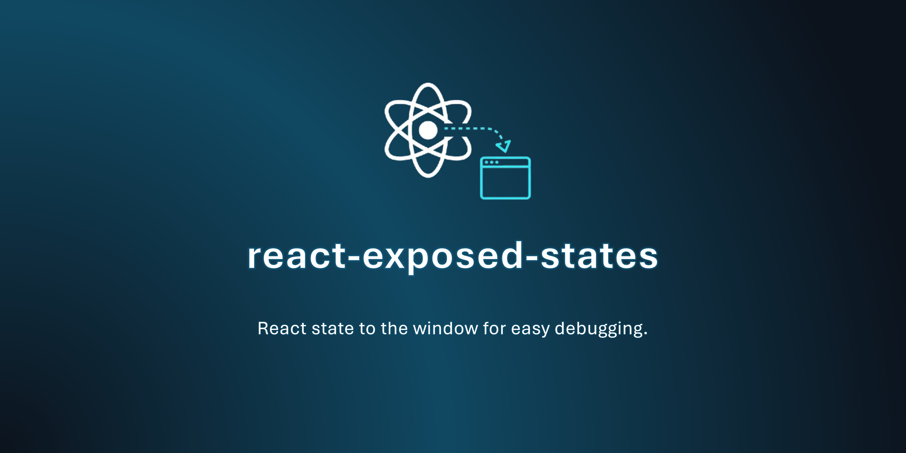

# React Exposed States

**_A lightweight utility that lets you expose React state values to the browser window. Perfect for debugging and quick runtime tweaks during development._**


---

## 🚀 Getting Started

A tiny utility that mirrors a component’s state to `window.exposed` with a stable key,
so you can inspect, modify, and subscribe to changes from the browser console.
Designed for **dev-only** workflows.

By default, the key used to expose the state is automatically generated per component instance (using React's `useId()`), so you don't need to specify it unless you want a custom readable key.

## 🚀 Install

```sh
npm install react-exposed-states
```

or

```sh
pnpm add react-exposed-states
```

## ☕ 60-Second TL;DR

```tsx
import { useState } from 'react';
import expose from 'react-exposed-states';

export default function Counter() {
  // By default, no key is needed; a unique component id will be used
  const [count, setCount] = expose(useState(0));
  // If you want to identify the state by a custom readable key, provide it as the second argument:
  // const [count, setCount] = expose(useState(0), 'myCounter');
  return <button onClick={() => setCount(c => c + 1)}>Count: {count}</button>;
}

// In the browser console:
// window.exposed.get('<r0>').state         // -> current value (check window.exposed to see the keys)
// window.exposed.get('<r0>').setState(42)  // -> updates React state
// window.exposed.get('<r0>').subscribe(v => console.log('changed to', v))
```

If you omit the second argument, the hook uses React’s `useId()` to generate a stable key per mount.
This means each exposed state is uniquely identified by its component instance unless you provide a custom key.

## 📖 Usage

```tsx
import { useState } from 'react';
import expose from 'react-exposed-states';

function Example() {

  // Default: auto key via component id
  const [value, setValue] = expose(useState({ name: 'John' }));

  // Custom readable key
  const [n, setN] = expose(useState(0), 'debug:counter');

  return (
    <div>
      <p>{value.name}</p>
      <button onClick={() => setN(n => n + 1)}>inc</button>
    </div>
  );
}
```

**Console helpers**

```js
// Read
window.exposed.get('debug:counter').state

// Write (value or updater)
window.exposed.get('debug:counter').setState(10)
window.exposed.get('debug:counter').setState(prev => prev + 1)

// Subscribe / unsubscribe
const off = window.exposed.get('debug:counter').subscribe(v => console.log(v))
off() // stop listening
```

## ⚙️ API

### `expose<T>(useStateReturn, uniqueName?) => [T, Dispatch<SetStateAction<T>>]`

Wraps a `useState` pair and registers it under `window.exposed`.

**Params**

* `useStateReturn` — the tuple from `useState<T>()`.
* `key?` — optional key (string). If omitted, a unique id for the component instance is used (via React's `useId()`).
  - By default, you do not need to specify a key; the hook will generate one for you.
  - If you want to identify the state by a custom readable key (e.g. for easier debugging or sharing between components), provide it as the second argument.

**window\.exposed.get(key)** returns an object:

* `state: T` — latest value
* `setState(next: T | (prev: T) => T)` — updates React state (and this mirror)
* `subscribe(cb: (v: T) => void): () => void` — listen to changes, returns an unsubscribe
* `unsubscribe(cb: Function)` — remove a previously added callback

**Lifecycle**

* The entry is created on mount and removed on unmount.
* All registered subscribers for a key are cleared on unmount.

## ⚠️ Notes & Limitations

* **Dev-only:** exposing state globally can leak sensitive data. Avoid using in production builds.
* **Key collisions:** choose descriptive keys (e.g. `feature:cart`) to avoid accidental overlap.
* **SSR/Node:** the hook accesses `window`; ensure tests run in a `jsdom` environment.

## ❓ FAQ

**Is this a state management library?**
No—it’s a tiny dev-tool wrapper around `useState` for inspection and ad-hoc mutation.

**Can I expose multiple states?**
Yes—call `expose` for each `useState` with different keys.

**What happens if I call `setState` only via `window.exposed`?**
React re-renders as usual; subscribers (if any) are notified.

## 🐞 Issues

Found a bug or have an idea? Open an issue:

* [https://github.com/HichemTab-tech/react-exposed-states/issues](https://github.com/HichemTab-tech/react-exposed-states/issues)

## Author

* [@HichemTab-tech](https://github.com/HichemTab-tech)

## License

[MIT](https://github.com/HichemTab-tech/react-exposed-states/blob/master/LICENSE)